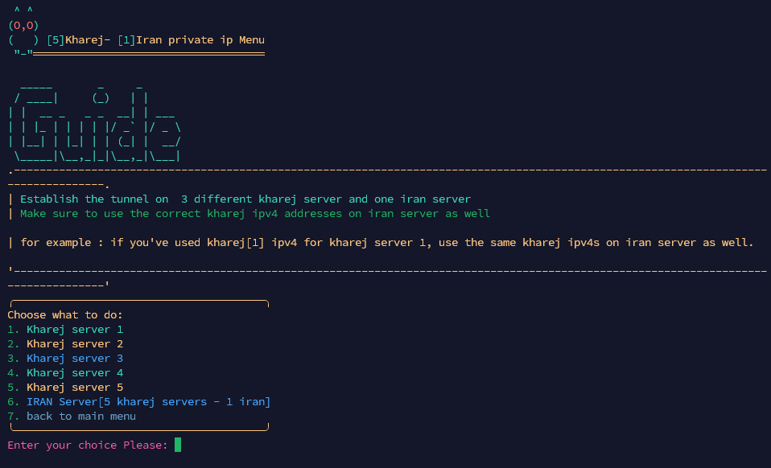

[English](/README.md) | [Persian](/README-Fa.md)

------------------------------------------
<p align="center">
  <picture>
    <source media="(prefers-color-scheme: dark)" srcset="./Media/Pic.png">
    
  </picture>
</p>


<h2 align="center"><strong>6TO4 Tunnel - Private IP (Multiple SERVERS)
  <br>
(Tunnel Between 5 Foreign Servers and 1 in Iran, and Vice Versa)
</strong></h2>

<br>

[](https://github.com/AMiR-SPB/6TO4-PrivateIP-MultipleSERVERS/releases)
[](#)
[](#)
[](https://www.gnu.org/licenses/gpl-3.0.en.html)

> **Disclaimer:** This project is only for personal learning and communication, please do not use it for illegal purposes, please do not use it in a production environment

<br>

## 🔧 Install & Upgrade

```
apt install curl -y && bash <(curl -Ls https://raw.githubusercontent.com/AMiR-SPB/6TO4-PrivateIP-MultipleSERVERS/main/6to4.sh --ipv4)
```

<br>

## **🌟 Features**  

- Create a 6to4 tunnel between multiple servers [Anycast] & [PrivateIP]  

- Tunnel between 5 foreign servers and 1 Iranian server, and vice versa  

- Ability to use the IP on other servers (not recommended) [Anycast]  

- Uses `cronjob` instead of `service`  

- Ability to delete tunnels  

- After setting up this tunnel, you can use the generated IPs for the main tunnel or port forwarding  

- Compatible with load balancing in FRP  

- Ability to create multiple private IPs for your servers  

 
<br>


##  📜 How To Use Script

<details>
  <summary>Click For Usage Instructions</summary>
  
  ### 🛠 Creating a Private IP Between 1 Foreign Server and 1 Iranian Server
  <details>
    <summary>Click For Details</summary>
    
      - Create a private IP: Start from the foreign server.  
      - Enter the IPv4 addresses of both the foreign and Iranian servers.  
      - Enter the /64 subnet.  
      - Specify the number of private IPs you need.  
      - Save the generated IPs in Notepad for use in the tunnel.  
      - The private IP and a ping service will be automatically created to prevent disruptions.  
      - Repeat the same steps for the Iranian server.  

  </details>

  <br>

  ### 🛠 Creating a Private IP Between 1 Foreign Server and 5 Iranian Servers
  <details>
    <summary>Click For Details</summary>

    🌍 Foreign Server Configuration
    
    - In this tunnel, we use 2 Iranian servers and 1 foreign server.  
    - Always start the tunnel configuration from the foreign server.  
    - Enter the number of Iranian servers you have (the maximum allowed is 5 servers).  
    - For each Iranian server, enter the same foreign IP (e.g., Turkey).  
    - Note: If you use the Yerevan IP for Iranian server 1, use the same Yerevan IP for the configuration of Iranian server 1.  
    - For example, if you use the Yerevan IP for server 1 and the Shatel IP for server 2, then in the Iranian server configuration, server 1 will use the Yerevan IP and server 2 will use the Shatel IP. Otherwise, the tunnel won't be established.  
    - Enter the number of IPs you need for each server.  
    - To create cronjobs for your servers, enter the number of servers with a space in between. For example, if you have 2 Iranian servers, enter it as (2 1).  

    ---

    🇮🇷 Iranian Server 1 Configuration

    - Now, we need to configure each Iranian server separately.  
    - For example, if for Iranian server 1, we used the Yerevan server IP (from the previous image), then we need to use the Yerevan IP here as well for Iranian server 1.  
    - The foreign server IP remains the same for all Iranian servers since the tunnel involves 3 Iranian servers and 1 foreign server.  
    - Enter the number of IPs you want for this server.  

    ---

    🇮🇷 Iranian Server 2 Configuration

    - For Iranian server 2, configure it as explained for Iranian server 1.  
    - The foreign server IP is the same for all Iranian servers.  
    - Enter the number of IPs you need for this server.  
    - If you have a third Iranian server, configure it in the same way as the previous servers.  
    - To remove tunnels, go to the relevant section to delete the tunnel.  

  </details>

  <br>

  ### 🛠 Creating a Private IP Between 5 Foreign Servers and 1 Iranian Server
  <details>
    <summary>Click For Details</summary>

    🌍 Foreign Server Configuration

    - Always start the tunnel configuration from the **foreign server**.  
    - Now, we need to configure each foreign server separately.  
    - The Iranian server is the same for all foreign servers, since the tunnel involves 3 foreign servers and 1 Iranian server.  
    - Enter the number of IPs you want for each foreign server.

    ---

    🌍 Foreign Server 2 Configuration

    - For foreign server 2, configure it similarly as you did for foreign server 1.  
    - The Iranian server is the same for all foreign servers.  
    - Enter the number of IPs you want for this server.  
    - If you have a third foreign server, configure it as shown in the example.  
    - To remove tunnels, go to the relevant section and delete the tunnel.  


    ---

    🇮🇷 Iranian Server Configuration

    - This tunnel uses 2 foreign servers and 1 Iranian server.  
    - Enter the number of foreign servers you have (the maximum allowed is 5 servers).  
    - For each foreign server, enter the same Iranian IP (e.g., Yerevan) and specify the foreign server IP for each server.  
    - Note: If you enter the Turkey IP for foreign server 1, use the same Turkey IP for the configuration of foreign server 1.  
    - This means that if you use the Turkey IP for server 1 and the Germany IP for server 2, the configuration of the foreign servers will also have Turkey IP for server 1 and Germany IP for server 2, otherwise, the tunnel will not be established.  
    - Enter the number of IPs you need for each foreign server.  
    - To create cronjobs for your servers, enter the number of servers with a space in between. For example, if you have 2 foreign servers, enter it as (2 1).  

  </details>
</details>


<br>
 

## **🌐 6 TO 4 Tunnel Types** 
<details>
  <summary>Click for Tunnel Details</summary>
  
  ### **❌ Tunnel Without Anycast**  
  <details>
    <summary>Click For Details</summary>
    
    🌍 Foreign Server Configuration
    
    - This tunnel uses one foreign server and one Iranian server.  
    - Start the tunnel configuration from the **foreign server**. Enter both the foreign and Iranian server IPs.  
    - Specify the number of IPs you need.  
    - To enable the ping service, enter the **IPv4 address of the Iranian server** as shown in the screenshot.  
    
    ---

    🇮🇷 Iranian Server Configuration

    - This tunnel uses one foreign server and one Iranian server.  
    - Enter both the foreign and Iranian server IPs.  
    - Specify the number of IPs you need.  
    - To enable the ping service, enter the **IPv4 address of the foreign server** as shown in the screenshot.  

  </details>

  <br>

  ### **✅ Tunnel with Anycast**  
  <details>
    <summary>Click For Details</summary>
    
    🌍 Foreign Server Configuration

    - This tunnel uses one foreign server and one Iranian server.  
    - Start the tunnel configuration from the **foreign server**. Enter the foreign server IP.  
    - Specify the number of IPs you need.  
    - To enable the ping service, enter the **IPv4 address of the Iranian server**.  
    - You can use this IP on other servers as well and get a ping, but the ping time depends on your server and may not be optimal.  
    
    ---

    🇮🇷 Iranian Server Configuration

    - This tunnel uses one foreign server and one Iranian server.  
    - Enter the **IPv4 address** of the Iranian server.  
    - Specify the number of IPs you need.  
    - To enable the ping service, enter the **IPv4 address of the foreign server**.  
    - You can use this IP on other servers as well and get a ping, but the ping time depends on your server and may not be optimal.  

  </details>
</details>

<br>

## 👀 Preview  
<details>
  <summary><strong>📷 Click to Expand Screenshots</strong></summary>
  <br>

  <picture>
    <source media="(prefers-color-scheme: dark)" srcset="./Media/Screenshot1.png">
    
  </picture>

  <br>

  <picture>
    <source media="(prefers-color-scheme: dark)" srcset="./Media/Screenshot2.png">
    
  </picture>

  <br>
</details>

<br>

## 🙏 A Special Thanks to

- [Azumi67](https://github.com/Azumi67/)


<br>
  
## **💻 Useful Scripts**  
> - These Scripts are Optional.  


#### OP Iran Script
```bash
apt install curl -y && bash <(curl -s https://raw.githubusercontent.com/opiran-club/VPS-Optimizer/main/optimizer.sh --ipv4)
```

#### Hawshemi Script
```bash
wget "https://raw.githubusercontent.com/hawshemi/Linux-Optimizer/main/linux-optimizer.sh" -O linux-optimizer.sh && chmod +x linux-optimizer.sh && bash linux-optimizer.sh
```

#### Add an Additional IPV6 Address
```bash
bash <(curl -s -L https://raw.githubusercontent.com/opiran-club/softether/main/opiran-seth)
```
------------------------------------------
